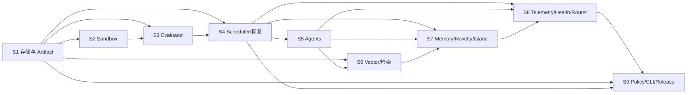

# 依赖关系与关键路径

## 1. Sprint 级依赖图



## 2. 关键路径

```text
S1 核心实体/事务
→ S2 Sandbox 协议与 Docker 执行
→ S3 EvaluationRun 状态机
→ S4 Lease/Scheduler/恢复
→ S5 Agent 全链路
→ S6 Hybrid Retriever
→ S7 NoveltyGate + Island
→ S8 MetaEvaluationWindow + HealthPolicy
→ S9 Policy 应用/回滚 + E2E + Go/No-Go
```

## 3. 可并行策略

- S2 的接口和镜像草案可在 S1 后半段并行，但 EnvironmentVersion 持久化必须等待 S1 schema。
- S3 的数据类设计可与 S2 实现并行，正式 plan validator 必须等待 Sandbox mount/env policy。
- S5 的 Agent 合约预研可在 S4 后半段开始，但接入 Scheduler 必须等待 S4 稳定。
- S6 的 EmbeddingProfile/VectorBackend 可与 S5 并行，ContextBuilder 接入混合检索必须等待 S5。
- S8 的 telemetry schema 可在 S7 后半段开始，指标闭合必须等待记忆与新颖性事件存在。
- S9 的 CLI 外壳可提前，但 Policy deployment、audit 与 release gate 必须等待 S8。

## 4. 禁止的伪并行

- 数据模型未冻结就并行写各 Repository。
- Sandbox 协议未冻结就同时写 Evaluator 和远程执行器。
- Telemetry 事件未定义就各模块自创日志字段。
- SearchPolicyGenome 未冻结就分别实现 router 调参、Prompt 调参和 mutation 调参。
- E2E 未通过就开始 Phase 4 自修改。

## 5. 依赖变更规则

任一关键路径接口发生破坏性变更，必须：

1. 更新 ADR 与需求追溯矩阵；
2. 标记受影响任务；
3. 重估关键路径；
4. 由高级模型/架构负责人审查；
5. 由用户决定延期、砍 scope 或接受返工。
